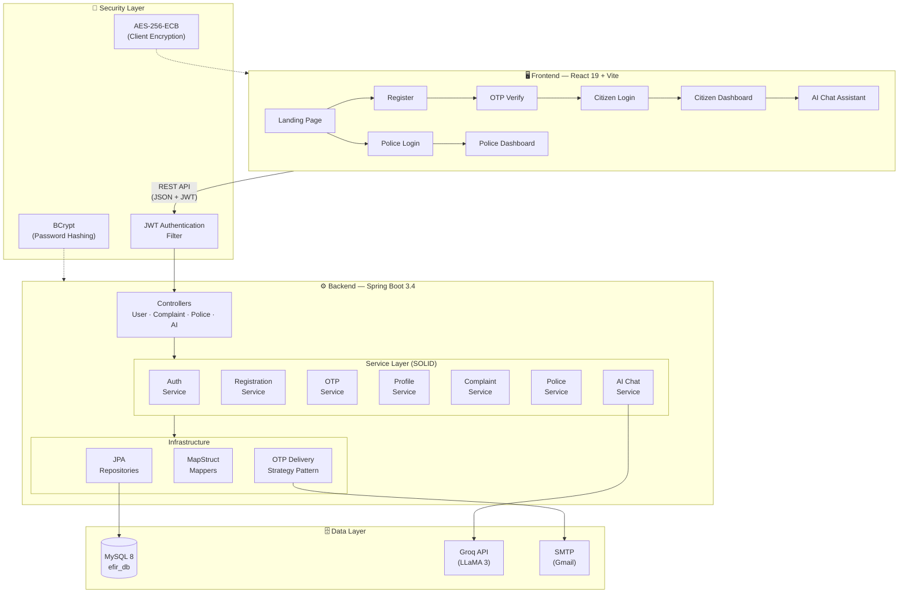

<p align="center">
  
  
  
  
  
  
  <a href="https://efir-system.vercel.app/"></a>
</p>

# 🛡️ eFIR — Electronic First Information Report System

> A full-stack civic legal platform enabling citizens to file FIR complaints digitally and police officers to review, accept, or reject them — built with **Spring Boot** and **React**.

### 🌐 [**Live Demo → efir-system.vercel.app**](https://efir-system.vercel.app/)

---

## 📋 Table of Contents

- [Overview](#-overview)
- [Features](#-features)
- [Tech Stack](#-tech-stack)
- [Architecture](#-architecture)
- [Project Structure](#-project-structure)
- [Getting Started](#-getting-started)
- [Environment Variables](#-environment-variables)
- [API Reference](#-api-reference)
- [Security](#-security)
- [Screenshots](#-screenshots)
- [Team](#-team)
- [License](#-license)

---

## 🔍 Overview

The **eFIR Complaint System** digitizes the First Information Report process. Citizens can register, verify via OTP, and file complaints online. Police officers access a dedicated dashboard to manage incoming complaints with pagination and verdict controls. All sensitive PII fields are **AES-256-ECB encrypted** on the frontend before transmission — the backend stores and returns them as-is, ensuring data privacy.

---

## ✨ Features

### 👤 Citizen Portal
- **Registration** with AES-encrypted PII fields (Aadhaar, name, address)
- **Email OTP verification** for account activation
- **JWT-based login** with auto-expiry detection
- **File FIR complaints** with victim, accused, and incident details
- **Track complaint status** (Processing → Succeeded / Rejected)
- **AI Legal Assistant** powered by Groq (LLaMA 3) for guidance

### 👮 Police Portal
- **Separate police login** with role-based access
- **Paginated complaint dashboard** with sorting
- **Accept or reject complaints** with one-click verdict
- **Seeded admin account** auto-created on startup

### 🔐 Security
- **AES-256-ECB** client-side encryption for all PII
- **BCrypt** password hashing
- **JWT authentication** (24h expiry)
- **Role-based route protection** (frontend + backend)
- **CORS policy** locked to allowed origins

---

## 🛠️ Tech Stack

### Backend
| Technology | Purpose |
|------------|---------|
| **Java 17+** | Language |
| **Spring Boot 3.4.2** | Application framework |
| **Spring Security 6.x** | JWT authentication & authorization |
| **Spring Data JPA / Hibernate** | ORM & database access |
| **MySQL 8** | Relational database |
| **MapStruct** | DTO ↔ Entity mapping |
| **Lombok** | Boilerplate reduction |
| **Springdoc OpenAPI** | Swagger UI auto-documentation |
| **JavaMailSender** | OTP email delivery |
| **WebClient (WebFlux)** | Groq AI API integration |

### Frontend
| Technology | Purpose |
|------------|---------|
| **React 19** | UI library |
| **Vite 6** | Build tool & dev server |
| **TailwindCSS 3.4** | Utility-first styling |
| **React Router v7** | Client-side routing |
| **Formik + Yup** | Form management & validation |
| **Axios** | HTTP client |
| **CryptoJS** | AES-256 client-side encryption |
| **react-hot-toast** | Toast notifications |
| **react-icons** | Icon library |
| **react-markdown** | AI response rendering |

---

## 🏗️ Architecture



---

## 📁 Project Structure

```
eFIR-Complaint-System/
│
├── Backend/eFIR/
│   ├── Dockerfile            # [NEW] Multi-stage backend build
│   ├── .dockerignore         # [NEW] Backend build ignore rules
│   ├── pom.xml
│   ├── src/main/java/com/efir/
│   │   ├── EfirApplication.java
│   │   ├── config/           # Security, CORS, JWT, Mail, OpenAPI
│   │   ├── controller/       # UserController, ComplaintController,
│   │   │                     # PoliceController, AiController
│   │   ├── service/
│   │   │   ├── auth/         # Registration + Authentication
│   │   │   ├── otp/          # OTP (Strategy Pattern)
│   │   │   ├── user/         # Profile retrieval
│   │   │   ├── complaint/    # Complaint filing
│   │   │   ├── police/       # Police operations
│   │   │   └── ai/           # Groq AI integration
│   │   ├── entity/           # User, Complaint, Person, Incidence,
│   │   │                     # Address, OtpRecord
│   │   ├── dto/              # Request & Response DTOs
│   │   ├── repository/       # JPA repository interfaces
│   │   ├── mapper/           # MapStruct mappers
│   │   ├── security/         # JWT provider, filter, UserDetails
│   │   ├── exception/        # Custom exceptions + GlobalHandler
│   │   └── util/             # OtpGenerator, RoleValidator
│   └── src/main/resources/
│       └── application.properties
│
├── Frontend/efir-complaint-system/
│   ├── Dockerfile            # [NEW] Multi-stage frontend build (Nginx)
│   ├── .dockerignore         # [NEW] Frontend build ignore rules
│   ├── nginx.conf            # [NEW] Nginx SPA routing config
│   ├── package.json
│   ├── index.html
│   ├── tailwind.config.js
│   ├── vite.config.js
│   └── src/
│       ├── App.jsx
│       ├── main.jsx
│       ├── api/              # Axios instance
│       ├── context/          # AuthContext, DecryptionHelper
│       ├── utils/            # AES encryption, session management
│       └── components/
│           ├── Landing.jsx
│           ├── Register.jsx
│           ├── Login.jsx
│           ├── PoliceLogin.jsx
│           ├── Verification.jsx
│           ├── Navigation.jsx
│           ├── ChatBox.jsx         # AI assistant
│           ├── ComplaintList.jsx
│           ├── PoliceDashboard.jsx
│           ├── ProtectedRoute.jsx
│           ├── DashBoard/
│           │   ├── Dashboard.jsx
│           │   ├── ComplaintSubmission.jsx
│           │   ├── Complaints.jsx
│           │   ├── Overview.jsx
│           │   └── SideBar.jsx
│           └── ui/           # ErrorBoundary, LoadingSpinner
│
└── README.md                 ← You are here
```

---

## 🚀 Getting Started

### Prerequisites

| Tool | Version |
|------|---------|
| **Java** | 17 or higher |
| **Maven** | 3.8+ |
| **Node.js** | 18+ |
| **npm** | 9+ |
| **MySQL** | 8.0+ |

### 1️⃣ Database Setup

```sql
CREATE DATABASE efir_db;
```

### 2️⃣ Backend Setup

```bash
cd Backend/eFIR

# Configure your database credentials in application.properties
# (or use environment variables — see below)

# Build & Run
mvn clean install
mvn spring-boot:run
```

The backend starts on **http://localhost:8085**
Swagger UI is available at **http://localhost:8085/swagger-ui.html**

> **Note:** A police admin account (`admin_police` / `Police@123`) is auto-seeded on first startup.

### 3️⃣ Frontend Setup

```bash
cd Frontend/efir-complaint-system

# Create .env file
cp .env.example .env

# Install dependencies
npm install

# Start development server
npm run dev
```

The frontend starts on **http://localhost:5173**

---

## 🐳 Docker Deployment (Recommended)

The entire system (MySQL + Backend + Frontend) can be launched using a single command:

### 1️⃣ Prerequisites
- **Docker** and **Docker Compose** installed.

### 2️⃣ Configuration
- Ensure your environment variables are set in `docker-compose.yml` (e.g., `MAIL_USERNAME`, `GROQ_API_KEY`).

### 3️⃣ Launch
```bash
# Build and start all services
docker-compose up -d --build
```

- **Frontend**: http://localhost:5173
- **Backend**: http://localhost:8085
- **MySQL**: localhost:3306

---

## 🔧 Environment Variables

### Backend (`application.properties`)

| Variable | Default | Description |
|----------|---------|-------------|
| `DB_USERNAME` | `root` | MySQL username |
| `DB_PASSWORD` | — | MySQL password |
| `JWT_SECRET` | — | JWT signing secret (min 32 chars) |
| `MAIL_USERNAME` | — | Gmail address for OTP |
| `MAIL_PASSWORD` | — | Gmail app password |
| `GROQ_API_KEY` | — | Groq API key for AI assistant |

### Frontend (`.env`)

| Variable | Default | Description |
|----------|---------|-------------|
| `VITE_API_BASE_URL` | `http://localhost:8085` | Backend API base URL |

---

## 📡 API Reference

All endpoints are documented via Swagger at `/swagger-ui.html`. Summary:

### Authentication (Public)

| Method | Endpoint | Description |
|--------|----------|-------------|
| `POST` | `/user/register` | Register new user |
| `POST` | `/user/login` | Citizen login → JWT (text/plain) |
| `POST` | `/user/login/police` | Police login → JWT (text/plain) |
| `POST` | `/user/sendOtp` | Send OTP to email |
| `POST` | `/user/verifyOtp` | Verify OTP → JWT (text/plain) |

### Citizen (JWT Required — Role: USER)

| Method | Endpoint | Description |
|--------|----------|-------------|
| `GET` | `/user/get` | Get user profile |
| `POST` | `/complaint/save` | File a new complaint |
| `GET` | `/complaint/fetch` | Get user's complaints |

### Police (JWT Required — Role: POLICE)

| Method | Endpoint | Description |
|--------|----------|-------------|
| `GET` | `/api/police/complaints` | Paginated complaint list |
| `POST` | `/api/police/update` | Accept/reject a complaint |

### AI (Public)

| Method | Endpoint | Description |
|--------|----------|-------------|
| `POST` | `/ai/api/groq` | AI legal assistant chat |

---

## 🔒 Security

| Layer | Mechanism |
|-------|-----------|
| **Password Storage** | BCrypt (Spring Security) |
| **PII Protection** | AES-256-ECB (client-side via CryptoJS) |
| **Authentication** | JWT (24h expiry, HS256) |
| **Authorization** | Role-based (`USER` / `POLICE`) on both frontend routes and backend endpoints |
| **Session** | Stateless (no server-side session) |
| **CORS** | Restricted to configured origins |
| **Input Validation** | Jakarta Bean Validation on all DTOs |

---

## 📸 Screenshots

> _Visit the **[Live Demo](https://efir-system.vercel.app/)** or run locally at `http://localhost:5173` to explore the full UI._

| Page | Route | Description |
|------|-------|-------------|
| 🏠 Landing | `/` | Hero section with feature highlights |
| 📝 Register | `/register` | Citizen registration with encrypted fields |
| 🔐 Login | `/login` | Citizen OTP-based login flow |
| 👮 Police Login | `/police-login` | Police credentials login |
| ✅ Verification | `/verification` | OTP input screen |
| 📊 Dashboard | `/dashboard` | File complaints, view status, AI chat |
| 🏛️ Police Dashboard | `/police-dashboard` | Review & verdict complaints |

---

## 👥 Team

| Role | Contributor |
|------|-------------|
| Backend Development | Shrihari Kulkarni |
| Frontend Development | Athrav Katavkar |
| Architecture & Design | Sanidhya Kulkarni |

---

## 📄 License

This project is licensed under the **MIT License** — see the [LICENSE](LICENSE) file for details.

---

<p align="center">
  <b>Built for Web Technology Laboratory Mini Project</b><br>
  <sub>Spring Boot · React · MySQL · AES-256 · JWT</sub><br><br>
</p>


 citizen_user
 Citizen@123

  admin_police
  Police@123